# Board Game Collection API

## Table of Contents

1.  [Project Description](#project-description)
2.  [Key Features](#key-features)
3.  [Technologies](#technologies)
4.  [Prerequisites](#prerequisites)
5.  [Installation and Configuration](#installation-and-configuration)
6.  [Running the Application](#running-the-application)
7.  [API Documentation (Endpoints)](#api-documentation-endpoints)
    *   [Authentication](#authentication)
    *   [Games (Board Games)](#games-board-games)
    *   [Users](#users)
    *   [Collections](#collections)
    *   [Reviews](#reviews)
8.  [OpenAPI (Swagger) Documentation](#openapi-swagger-documentation)
9. [Database Structure](#database-structure)
10. [Error Handling](#error-handling)

---

## Project Description

**Board Game Collection API** is a RESTful application built with Java using the Spring Boot framework. It allows users to manage a board game collection, including user registration and login, browsing games, adding games to personal collections, and adding/managing reviews. The application utilizes user roles (ADMIN, USER) for access control to specific resources.

---

## Key Features

*   **User Registration and Login:** Secure authentication using JSON Web Tokens (JWT).
*   **Board Game Management (CRUD):** Browsing games available to all logged-in users. Adding, editing, and deleting games restricted to administrators.
*   **User Game Collection Management:** Logged-in users can add and remove games from their personal collection.
*   **Game Review Management (CRUD):** Logged-in users can add reviews for games. Editing and deleting reviews is restricted to the review author or an administrator.
*   **User Roles:** Implementation of `USER` and `ADMIN` roles with appropriate permissions for API resources.
*   **Data Validation:** Input data validation for API endpoints.
*   **Global Exception Handling:** Consistent error responses for the client.

---

## Technologies

*   **Backend:**
    *   Java 21
    *   Spring Boot 3.4.4
    *   Spring Data JPA
    *   Spring Security
*   **Database:**
    *   MySQL
    *   Flyway (for database migration management)
*   **Authentication:**
    *   JSON Web Tokens (JWT)
*   **Tooling:**
    *   Maven 
    *   SpringDoc OpenAPI
*   **Validation:**
    *   Jakarta Bean Validation

---

## Prerequisites

*   **JDK 21** or later
*   **Maven 3.6+**
*   **MySQL Server** 
*   **REST Client** Postman for API testing

---

## Installation and Configuration

1.  **Clone the repository:**
    ```bash
    git clone git@github.com:montelzek/boardgame-api.git
    cd boardgameapi
    ```

2.  **Configure the MySQL database:**
    *   Create a new database, e.g., `boardgames`.

3.  **Update the database connection configuration:**
    *   Open the file `src/main/resources/application.properties`.
    *   Modify the following properties according to your MySQL setup:
      ```properties
      spring.datasource.url=jdbc:mysql://localhost:3306/boardgames
      spring.datasource.username=your_mysql_user
      spring.datasource.password=your_mysql_password
      ```
      *(Default values in the code are `root` / `root`)*

4.  **Database Migrations (Flyway):**
    *   The project uses Flyway to manage the database schema.
    *   SQL scripts for creating tables are located in `src/main/resources/db/migration`.
    *   Flyway will automatically run migrations on the first application startup, creating the necessary tables and adding an initial admin user.

5.  **Build the project using Maven:**
    ```bash
    mvn clean install
    ```

---

## Running the Application

You can run the application in several ways:

1.  **Using Maven:**
    ```bash
    mvn spring-boot:run
    ```

3.  **Running the packaged JAR file:**
    *   After building the project (`mvn clean install`), the JAR file will be in the `target/` directory.
    *   Run the application using the command:
      ```bash
      java -jar target/boardgameapi-0.0.1-SNAPSHOT.jar
      ```

The application will start by default on port `8080`. You can access the API at `http://localhost:8080`.

---

## API Documentation (Endpoints)

### Authentication

*   **`POST /auth/register`**
    *   **Description:** Registers a new user in the system.
    *   **Authentication:** Not required.
    *   **Request Body:**
        ```json
        {
          "fullName": "John Doe",
          "email": "john.doe@example.com",
          "password": "password123"
        }
        ```
    *   **Response:** Returns a JWT token upon successful registration.
        ```json
        {
          "token": "eyJhbGciOiJIUzUxMiJ9..."
        }
        ```
    *   **Postman:** <br/><br/>
        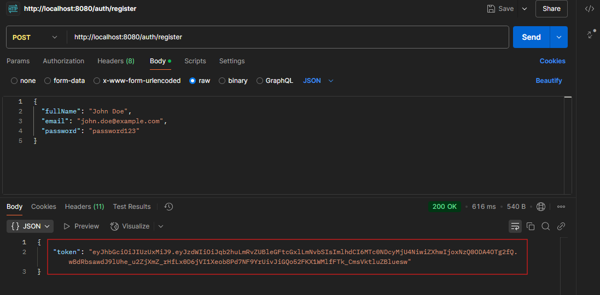 <br/><br/>

*   **`POST /auth/login`**
    *   **Description:** Logs in an existing user and returns a JWT token.
    *   **Authentication:** Not required.
    *   **Request Body:**
        ```json
        {
          "email": "john.doe@example.com",
          "password": "password123"
        }
        ```
    *   **Response:** Returns a JWT token upon successful login.
        ```json
        {
          "token": "eyJhbGciOiJIUzUxMiJ9..."
        }
        ```
    *   **Postman:** <br/><br/>
        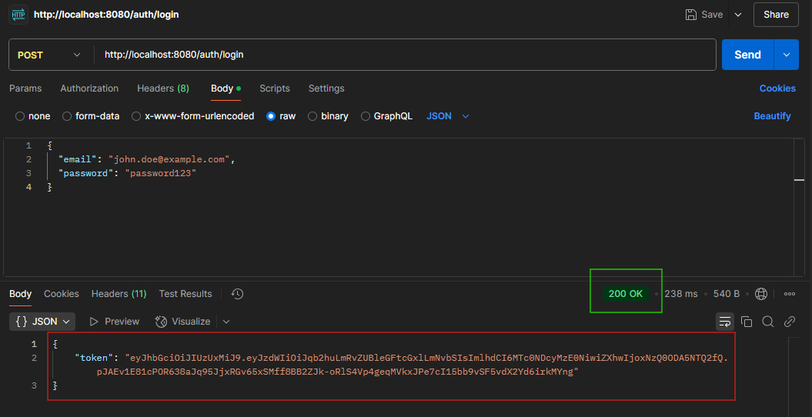 <br/><br/>

### Games (Board Games)

*   **`GET /games`**
    *   **Description:** Retrieves a list of all board games.
    *   **Authorization:** Requires JWT Authentication (for logged-in users).
    *   **Response:** Returns a list of game objects.
    *   **Postman:** <br/><br/>
        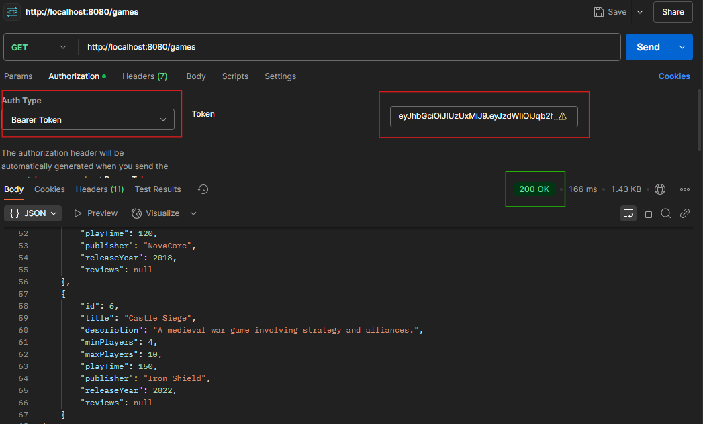 <br/><br/>

*   **`GET /games/{id}`**
    *   **Description:** Retrieves details of a game by its ID.
    *   **Authorization:** Requires JWT Authentication.
    *   **Response:** Returns the game object, including its reviews.
    *   **Postman:** <br/><br/>
        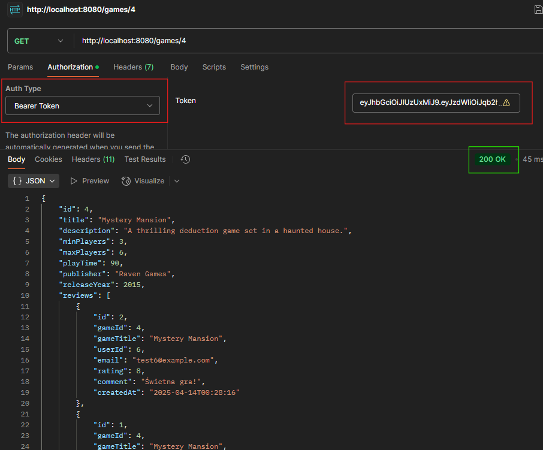 <br/><br/>

*   **`POST /games`**
    *   **Description:** Adds a new board game.
    *   **Authorization:** Requires JWT Authentication and `ADMIN` role.
    *   **Request Body:**
        ```json
        {
          "title": "Carcassonne",
          "description": "A tile-placement game...",
          "minPlayers": 2,
          "maxPlayers": 5,
          "playTime": 45,
          "publisher": "Hans im Glück",
          "releaseYear": 2000
        }
        ```
    *   **Response:** `201 Created`. Returns the newly created game object.
    *   **Postman:** <br/><br/>
        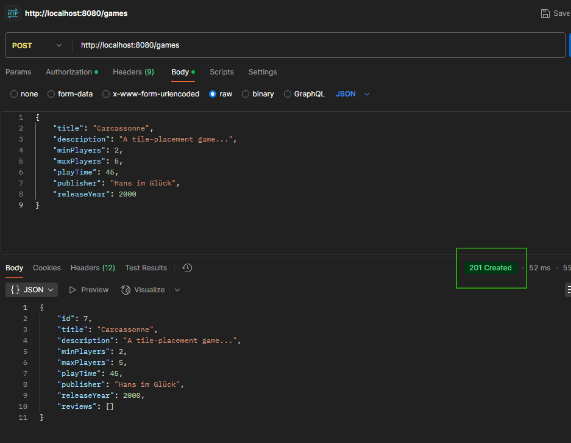 <br/><br/>

*   **`PUT /games/{id}`**
    *   **Description:** Updates an existing board game.
    *   **Authorization:** Requires JWT Authentication and `ADMIN` role.
    *   **Request Body:** Contains fields to be updated.
        ```json
        {
          "title": "Carcassonne - Big Box Edition",
          "description": "Expanded version of the game...",
          "minPlayers": 2,
          "maxPlayers": 6,
          "playTime": 60,
          "publisher": "Hans im Glück / Z-Man Games",
          "releaseYear": 2017
        }
        ```
    *   **Response:** `200 OK`. Returns the updated game object.
    *   **Postman:** <br/><br/>
        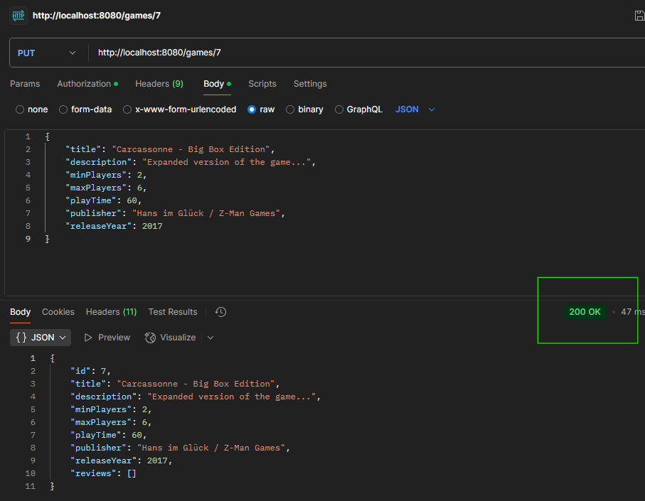 <br/><br/>

*   **`DELETE /games/{id}`**
    *   **Description:** Deletes a board game by its ID.
    *   **Authorization:** Requires JWT Authentication and `ADMIN` role.
    *   **Response:** `204 No Content`.
    *   **Postman:** <br/><br/>
        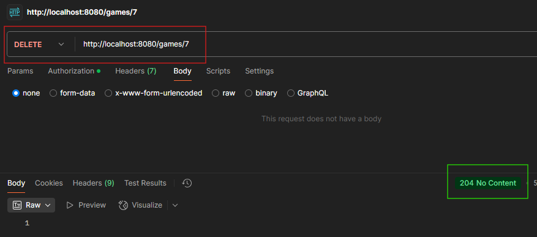 <br/><br/>

### Users

*   **`GET /users/{id}`**
    *   **Description:** Retrieves details of a user by ID (including their collection and reviews).
    *   **Authorization:** Requires JWT Authentication.
    *   **Response:** Returns the user object.
    *   **Postman:** <br/><br/>
        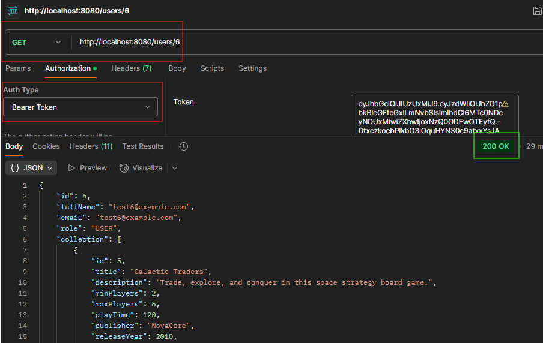 <br/><br/>

*   **`PUT /users/{id}`**
    *   **Description:** Updates user data (full name, email, password).
    *   **Authorization:** Requires JWT Authentication. Only the profile owner can update it.
    *   **Request Body:**
        ```json
        {
          "fullName": "Jane Doe-Smith",
          "email": "jsmith@example.com",
          "password": "newSecurePassword123"
        }
        ```
    *   **Response:** `200 OK`. Returns the updated user object.
    *   **Postman:** <br/><br/>
        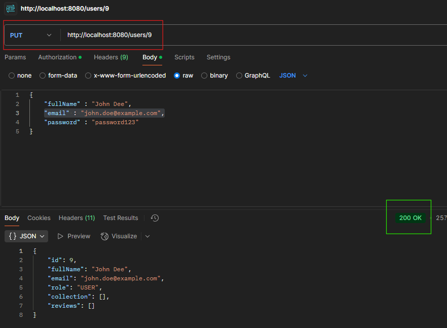 <br/><br/>

*   **`DELETE /users/{id}`**
    *   **Description:** Deletes a user account.
    *   **Authorization:** Requires JWT Authentication. Only the profile owner or an administrator can delete the account.
    *   **Response:** `204 No Content`.
    *   **Postman:** <br/><br/>
        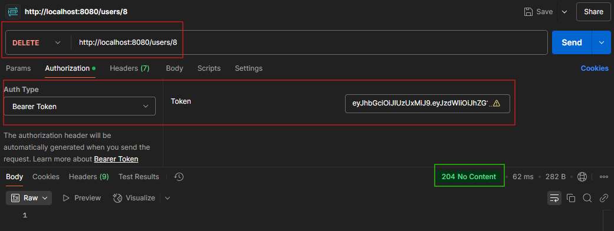 <br/><br/>

### Collections

*   **`GET /users/{userId}/collection`**
    *   **Description:** Retrieves the list of games in the collection of the user with the specified `userId`.
    *   **Authorization:** Requires JWT Authentication.
    *   **Response:** Returns a list of game objects from the collection.
    *   **Postman:** <br/><br/>
        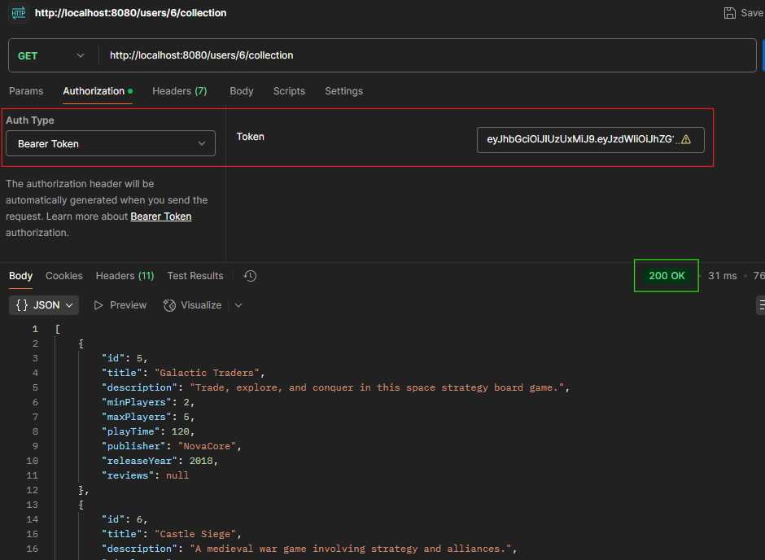 <br/><br/>

*   **`POST /users/{userId}/collection`**
    *   **Description:** Adds a game with the specified `gameId` to the collection of the user `userId`.
    *   **Authorization:** Requires JWT Authentication. The user can only modify their own collection (`userId` must match the logged-in user).
    *   **Request Body:**
        ```json
        {
          "gameId": 4
        }
        ```
    *   **Response:** `201 Created`. Returns a confirmation message.
        ```json
        {
            "message": "Game with ID 4 added to user 6's collection successfully"
        }
        ```
    *   **Postman:** <br/><br/>
        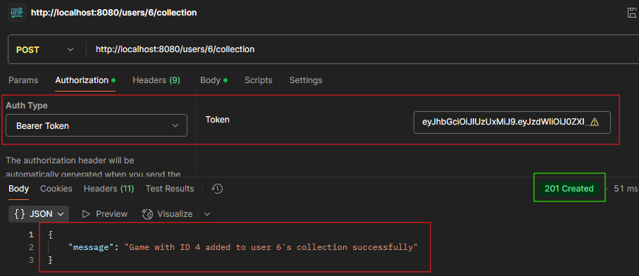 <br/><br/>

*   **`DELETE /users/{userId}/collection/{gameId}`**
    *   **Description:** Removes the game with the specified `gameId` from the collection of the user `userId`.
    *   **Authorization:** Requires JWT Authentication. The user can only modify their own collection.
    *   **Response:** `204 No Content`.
    *   **Postman:** <br/><br/>
        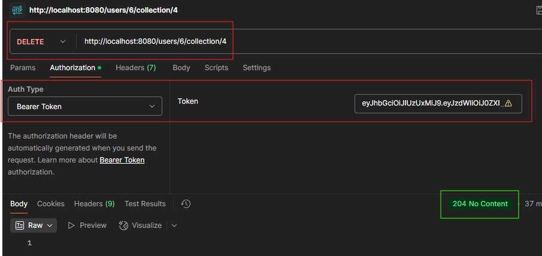 <br/><br/>

### Reviews

*   **`GET /games/{gameId}/reviews`**
    *   **Description:** Retrieves all reviews for the game with the specified `gameId`.
    *   **Authorization:** Requires JWT Authentication.
    *   **Response:** Returns a list of review objects.
    *   **Postman:** <br/><br/>
        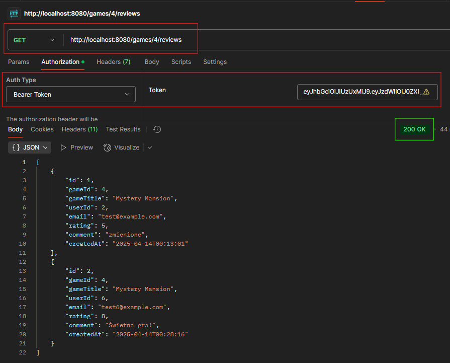 <br/><br/>

*   **`POST /games/{gameId}/reviews`**
    *   **Description:** Adds a new review for the game with the specified `gameId`. A user can only add one review per game.
    *   **Authorization:** Requires JWT Authentication.
    *   **Request Body:**
        ```json
        {
          "rating": 9,
          "comment": "Great game!"
        }
        ```
    *   **Response:** `201 Created`. Returns the newly created review object.
    *   **Postman:** <br/><br/>
        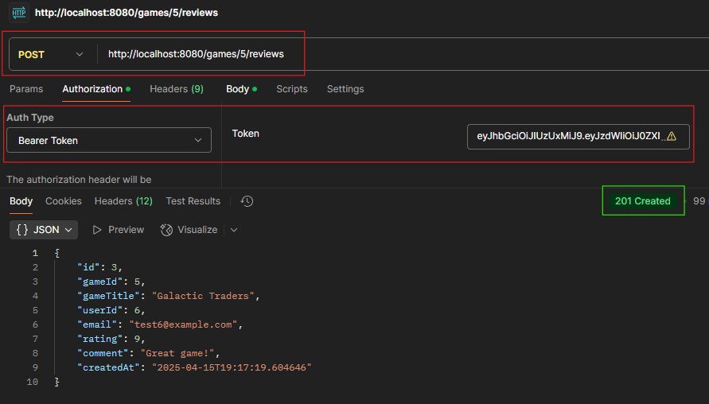 <br/><br/>

*   **`PUT /reviews/{reviewId}`**
    *   **Description:** Updates an existing review with the specified `reviewId`.
    *   **Authorization:** Requires JWT Authentication. Only the author of the review can edit it.
    *   **Request Body:**
        ```json
        {
          "rating": 5,
          "comment": "Not that great!"
        }
        ```
    *   **Response:** `200 OK`. Returns the updated review object.
    *   **Postman:** <br/><br/>
        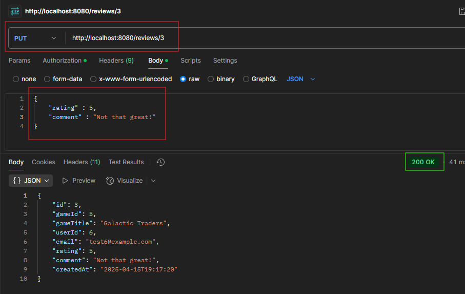 <br/><br/>

*   **`DELETE /reviews/{reviewId}`**
    *   **Description:** Deletes the review with the specified `reviewId`.
    *   **Authorization:** Requires JWT Authentication. Only the author of the review or an administrator can delete it.
    *   **Response:** `204 No Content`.
    *   **Postman:** <br/><br/>
        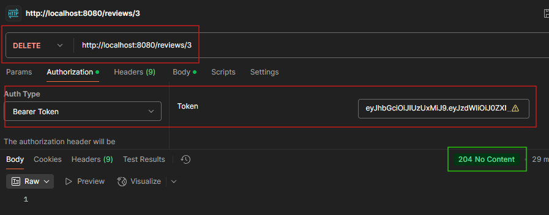 <br/><br/>

---

## OpenAPI (Swagger) Documentation

The project integrates with SpringDoc OpenAPI.

After starting the application, the Swagger UI documentation is available at:
`http://localhost:8080/swagger-ui/index.html`

The OpenAPI specification in JSON format is available at:
`http://localhost:8080/v3/api-docs`

---

## Database Structure

<br/><br/>
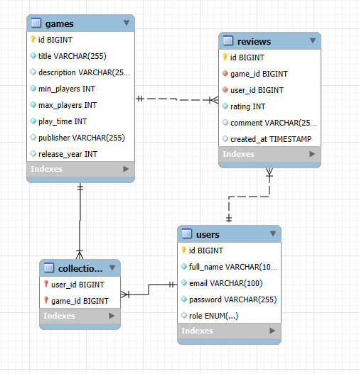 <br/><br/>

---

## Error Handling

The application uses a global exception handler (`GlobalExceptionHandler.java`) for consistent error management:

*   **Validation Errors (`MethodArgumentNotValidException`):** Returns `400 Bad Request` with a list of field validation errors.
*   **Resource Not Found (`ResourceNotFoundException`):** Returns `404 Not Found`.
*   **Bad Credentials (`BadCredentialsException`):** Returns `401 Unauthorized`.
*   **Access Denied (`AccessDeniedException`):** Returns `403 Forbidden`.
*   **Conflict (e.g., duplicate email, duplicate review) (`ResponseStatusException`, `IllegalStateException`):** Returns `409 Conflict`.
*   **Other Server Errors (`Exception`):** Returns `500 Internal Server Error`.

Error responses are returned in JSON format: `{"error": "Error message"}` or for validation errors: `{"field": "message", ...}`.
